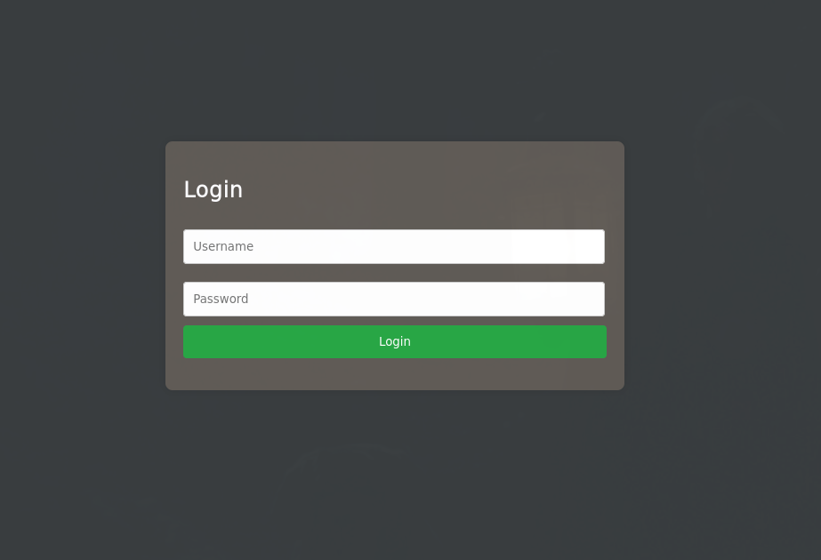
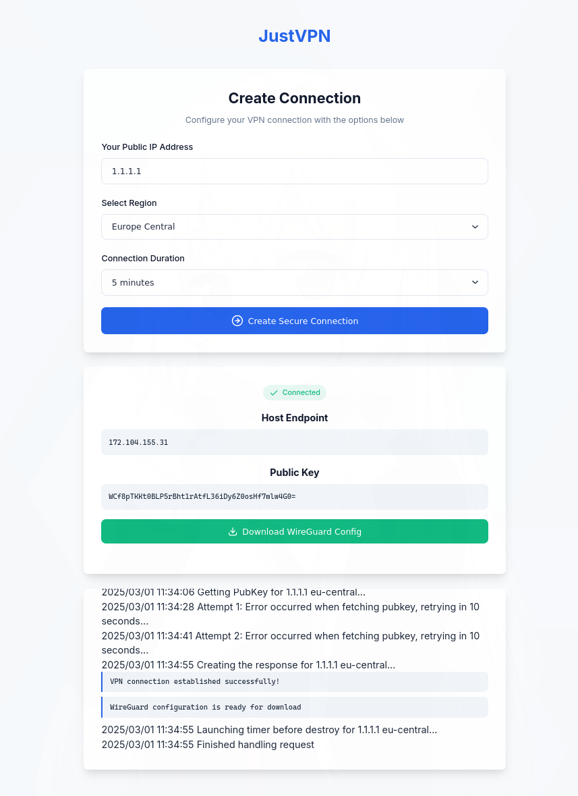

# JustVPN

JustVPN is a self-hosted VPN solution that allows you to provision a Wireguard VPN server on a Linode Nanode instance with just a few clicks. It uses Terraform for infrastructure provisioning and provides a simple web interface for managing your VPN connections.

## Features

- One-click deployment of Wireguard VPN server on Linode
- User authentication system
- Web-based interface for managing VPN connections
- Automatic configuration file generation for Wireguard clients
- Live logs of the provisioning process
- Configurable connection duration with automatic cleanup
- Fully configurable through environment variables

## Preview




## Prerequisites

- [Go](https://golang.org/doc/install) (1.18 or later)
- [Terraform](https://developer.hashicorp.com/terraform/tutorials/aws-get-started/install-cli) (1.9.x or later)
- [Node.js](https://nodejs.org/) (for frontend development, optional)
- A [Linode](https://www.linode.com/) account with API access

## Installation

### 1. Clone the Repository

```bash
git clone https://github.com/yourusername/JustVPN.git
cd JustVPN
```

### 2. Configure Environment Variables

Copy the example environment file and edit it with your settings:

```bash
cp .env.example .env
```

Edit the `.env` file with your preferred text editor:

```
SSH_PASSWORD=your-ssh-password-for-vpn-servers
JWT_SECRET=your-secure-jwt-secret-for-authentication
API_PORT=8081
USERS_FILE_PATH=./src/users.json
TERRAFORM_WORKING_DIR=./src
IAC_DIR_PATH=../iac
FRONTEND_CORS_ORIGIN=*
```

For production edit `frontend/config.js` API url

### 3. Configure Terraform Variables

Copy the example Terraform variables file and edit it with your Linode API credentials:

```bash
cp iac/secrets.tfvars.example iac/secrets.tfvars
```

Edit the `iac/secrets.tfvars` file:

```
linode_token = "your-linode-api-token"
root_pass = "secure-root-password-for-deployed-servers"
```

### 4. Set Up User Authentication

Create a hashed password for your user(s):

```bash
# Install bcrypt tool if you don't have it
go install github.com/unixpickle/gobcrypt/bcrypt@latest

# Generate a hashed password
echo -n "your_password_here" | bcrypt
```

Edit the `src/users.json` file to include your username and the hashed password:

```json
{
  "users": [
    {
      "username": "YourUsername",
      "password": "hashed-password-from-bcrypt"
    }
  ]
}
```

### 5. Install Dependencies

```bash
cd src
go mod tidy
```

### 6. Initialize Terraform

```bash
cd src
terraform init
cd ..
```

## Running JustVPN

### Start the Backend Server

```bash
go run src/main.go
```

The server will start on port 8081 (or the port specified in your `.env` file).

### Access the Web Interface

Open your browser and navigate to:

```
http://localhost:8081
```

If you want to serve the frontend from a different location, you can copy the `frontend` directory to your web server.

### Using Docker

You can also run JustVPN using Docker:

```bash
# Build the Docker image
docker build -t justvpn:latest .

# Build and run the containers
docker-compose up -d
```

## Configuration Options

JustVPN is highly configurable through environment variables:

| Variable | Description | Default Value |
|----------|-------------|---------------|
| SSH_PASSWORD | SSH password for VPN servers | *Required* |
| JWT_SECRET | Secret for JWT authentication | *Required* |
| USERS_FILE_PATH | Path to users JSON file | ./src/users.json |
| TERRAFORM_WORKING_DIR | Working directory for Terraform | ./src |
| IAC_DIR_PATH | Path to infrastructure as code files | ../iac |
| API_BASE_URL | Base URL for API endpoints | http://localhost:8081 |
| FRONTEND_CORS_ORIGIN | CORS origin configuration | * |

## Frontend Development

The frontend is built with vanilla JavaScript and can be customized as needed:

- All API URLs are configurable through the `config.js` file
- WebSocket connections are automatically configured based on the current protocol

## Tips

- Linode offers nearly unlimited free data transfer on their Nanode instances, making it an ideal choice for VPN hosting.
- For security reasons, VPN servers are automatically destroyed after the specified duration.
- You can modify the `iac/variables.tf` file to customize the VPN server configuration.

## License

[MIT License](LICENSE)
