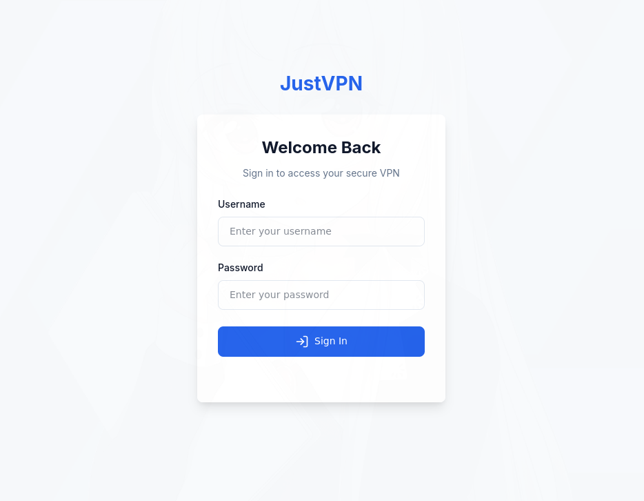

# JustVPN

Golang script to provision a selfhosted VPN on a linode nanode instance in one click using wireguard and terraform.

# Preview




# Installation

0) Fill the .env.example
Rename `.env.example` to `.env`
```
mv .env.example .env 
```

1) Fill the secrets.tfvars.example

Rename `secrets.tfvars.example` to `secrets.tfvars`
```
mv secrets.tfvars.example secrets.tfvars
```

2) Init terraform

```
terraform init
```

3) Get the dependencies
```
go get
```

4) Generate a hased password for your user
```
echo -n "your_password_here" | bcrypt
```

Put the hashed password into the `users.json`

# Usage

Start the API
```
go run main.go
```

Request your bearer token
```
curl -X POST -H "Content-Type: application/json" -d '{"username":"John","password":"test1"}' localhost:8081/login
```

Request a wireguard server
```
curl -X GET -H "Authorization: Bearer <token>" --data "IP=<your_public_ip>&timeWantedBeforeDeletion=100" localhost:8081/start
```

# Tips

While its technically possible to use any cloud provider to create your own VPN hoster, I highly recommend using Linode as they offer nearly infinite **free** data transfer on their VPS offer like the nanode.
